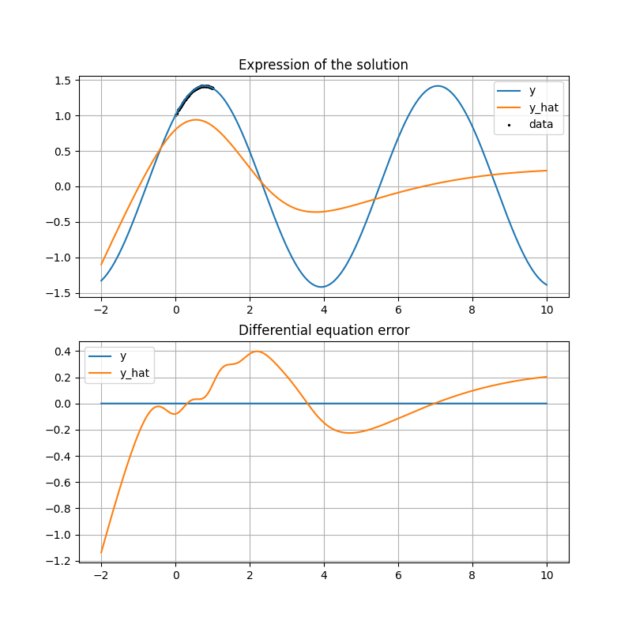

# Differential Equation

This repository solves differential equations using neural networks.
Approximates the expression that is the solution to a differential equation with a neural network.
To learn the underlying equations of a system, it is enough to have the differential equations that the system follows and some real data.

It was not designed with utility in mind, but rather as an experiment.
For example, the point at which it takes a solution to learn a solution.

## Training Model

To train the model, enter the following command.

```
python src/train.py
```

The results of the training are output to `trained/`.
The learning process is recorded in TensorBoard.
TensorBoard is launched by the following command.

```
tensorboard --logdir=trained
```

The approximation performance of the model can be checked from the following image on TensorBoard.

|                                                                                                                                                                         Model / Differential equation / Solution expression                                                                                                                                                                          |                           epoch 0                            |                           epoch 1000                            |                           epoch 3000                            |                           epoch 20000                            |
| :--------------------------------------------------------------------------------------------------------------------------------------------------------------------------------------------------------------------------------------------------------------------------------------------------------------------------------------------------------------------------------------------------: | :----------------------------------------------------------: | :-------------------------------------------------------------: | :-------------------------------------------------------------: | :--------------------------------------------------------------: |
|                                                                                      210401-055205-beautiful_tu /  / %20%2B%20\sin(x))                                                                                      |   |   |   |   |
|                                                                                     210401-055656-vibrant_euler /  / %20%2B%20\sin(x))                                                                                      |  |  |  |  |
| 210401-060649-cool_benz /  / %20%2B%20\sin(x)) / %20(%20\sin(\frac{\sqrt{3}}{2}%20x)%20%2B%20\cos(\frac{\sqrt{3}}{2}%20x))) |      |      |      |      |

As the epoch progresses, the orange estimated plot on the image gradually approaches the blue correct answer plot.
The residuals when substituted into the differential equation, shown below the image, are also gradually approaching zero.
Here we learn only for `-1<x<9`, and the performance is bad for unlearned `x<-1` and `9<x`.
## Change Target Differential Equation

The differential equations of the target and the expressions of their solutions are written in `equation.py`.
The differential equation is written in the `differential_equation` function, and the solution expression in the `expression` function.
If you do not know the solution to a differential equation, it is not supported.
(I know it sounds funny that it takes a solution to learn a solution, but...)

## File Description

```
├── README.md
├── requirements.txt
│
├── src                 Main src files.
│   ├── train.py        Training model.
│   ├── equation.py     Definitions of differential equations and expression.
│   ├── model.py        Definition of model architecture.
│   └── dataset.py      Definition of dataset.
│
└── trained/        Output files by train.py.
```
